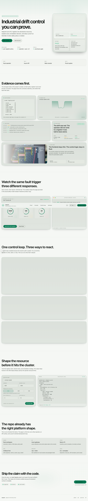
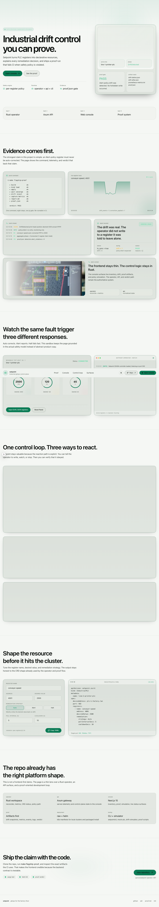
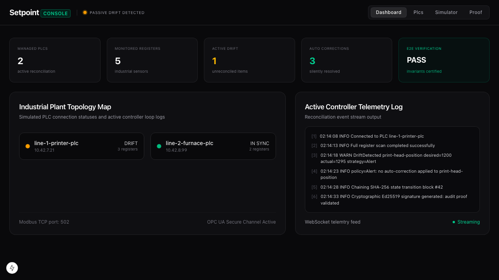

# Setpoint

> **GitOps for the factory floor.**
> A Kubernetes operator that reconciles industrial PLCs as first-class
> resources, with per-register remediation policies and a machine-checkable
> proof of behavior.

[](https://github.com/apinzon/setpoint-operator/actions/workflows/ci.yml)
[](https://github.com/apinzon/setpoint-operator/actions/workflows/e2e-proof.yml)
[](LICENSE)


```yaml
apiVersion: setpoint.io/v1
kind: IndustrialPLC
metadata:
  name: line-1-printer-plc
spec:
  deviceAddress: plc-1.factory.lan
  port: 502
  registers:
    - name: conveyor-speed
      address: 4001
      desiredValue: 2500
      remediation:
        strategy: Auto
        pollIntervalSecs: 5
    - name: print-head-position
      address: 4002
      desiredValue: 1200
      remediation:
        strategy: Alert       # detected, not auto-corrected
        pollIntervalSecs: 5
```

The desired state of every register is git-tracked YAML. The operator
polls the live device, detects drift, and applies the per-register
remediation policy. **Auto** silently writes the desired value back;
**Alert** emits a `Warning DriftDetected` event and bumps a metric
but does not write; **Halt** marks the resource `Failed`.

## Run the flagship proof

The whole project is built around a single CI-checkable claim:

> An operator that auto-corrects an Alert-policy register is broken,
> even if everything else looks fine.

Reproduce it locally:

```sh
make flagship-proof
cat artifacts/latest/proof.json
cat artifacts/latest/report.md
```

This boots a kind cluster, deploys the operator + mock PLC, injects
deterministic drift on the Alert-policy register, and writes a
binary `verdict: PASS | FAIL` plus a human-readable report. The
same flow runs in CI on every PR; see
[`.github/workflows/e2e-proof.yml`](.github/workflows/e2e-proof.yml).

## What it looks like

<table>
<tr>
<td align="center"><b>Landing page</b></td>
<td align="center"><b>Evidence section</b></td>
</tr>
<tr>
<td></td>
<td></td>
</tr>
<tr>
<td align="center"><b>Console</b></td>
<td align="center"><b>Flagship proof</b></td>
</tr>
<tr>
<td></td>
<td></td>
</tr>
</table>

## Install

### Helm

```sh
helm repo add setpoint https://apinzon.github.io/setpoint-operator
helm install setpoint setpoint/setpoint
```

### Raw manifests

```sh
kubectl apply -f k8s/crd.yaml
kubectl apply -f k8s/rbac.yaml
kubectl apply -f k8s/deployment.yaml
kubectl apply -f config/samples/industrialplc-line1.yaml
```

The sample targets an in-cluster `setpoint-mock-plc` service on
port 5502; deploy `k8s/mock-plc.yaml` first if you don't have real
hardware. Use `k8s/deployment-local.yaml` (imagePullPolicy: Never,
tag `:latest`) for local kind/minikube work.

## Development

### Prerequisites

The repo uses different toolchains depending on which part you are
working on:

- Rust and Cargo for the workspace binaries
- Docker for local images and compose services
- `kubectl` and Helm for cluster packaging and deployment
- `jq` for proof artifact generation
- `kind` for local end-to-end cluster runs
- Node/npm for the `landing/` Next.js app

`ci-local.sh` checks for `cargo`, `docker`, `helm`, and `kubectl`
up front, and skips some optional checks when `trivy` or `kind`
are not installed.

### Common commands

From the repo root:

```sh
make build            # cargo build --release --workspace
make build-debug      # cargo build --workspace
make fmt              # cargo fmt --all -- --check
make fmt-fix          # cargo fmt --all
make lint             # cargo clippy --workspace --all-targets -- -D warnings
make test             # cargo test --workspace
make ci-local         # local CI bundle
make helm-lint        # helm lint charts/setpoint
make helm-template    # render chart locally
make k8s-apply        # apply raw manifests for local cluster work
make k8s-delete       # remove raw manifests
make obs-up           # start Prometheus + Grafana
make obs-down         # stop Prometheus + Grafana
make demo             # start local demo environment
make demo-cleanup     # stop demo resources and local processes
make flagship-proof   # run the proof end to end
make proof-cleanup    # clean resources created by the proof
make proof-report     # regenerate report from captured artifacts
```

For the landing app:

```sh
npm --prefix landing install
npm --prefix landing run dev
npm --prefix landing run build
npm --prefix landing run start
npm --prefix landing run lint
cd landing && npm exec -- tsc --noEmit
```

There is no dedicated root-level JavaScript task runner. The TypeScript
typecheck command above is derived from the checked-in `landing/tsconfig.json`
and local `typescript` dependency.

## How it works

```
┌──────────┐  watch  ┌─────────────┐  poll  ┌──────────────┐
│  git /   │ ──────▶ │  Setpoint   │ ─────▶ │  Modbus PLC  │
│  kubectl │ ◀────── │  operator   │ ◀───── │  (registers) │
└──────────┘  patch  └─────────────┘  write └──────────────┘
                              │
                              ▼
                     ┌──────────────────┐
                     │  setpoint_*      │
                     │  Prometheus      │
                     │  metrics         │
                     └──────────────────┘
                              │
                              ▼
                  ┌────────────────────────┐
                  │  Warning DriftDetected │
                  │  / Normal              │
                  │  DriftCorrected events │
                  └────────────────────────┘
```

The full architecture, including failure modes and reconciliation
loop, lives in [`docs/ARCHITECTURE.md`](docs/ARCHITECTURE.md).

## Repository layout

```
crates/
  operator/         the Kubernetes operator (reconciler + metrics)
  setpointctl/      CLI (get-status, watch, sync)
  mock-plc/         Modbus TCP server with optional chaos mode
  drift-simulator/  overwrites a register on demand for the proof run
k8s/                raw manifests (CRD, RBAC, deployment, sample, mock)
charts/setpoint/    Helm chart
config/samples/     reference IndustrialPLC resources
docs/               architecture, ADRs, executive summary, proof
artifacts/          proof run output (templates ship here; real run overwrites)
scripts/            flagship-proof.sh, capture-metrics.sh, generate-report.sh
```

Generated or local-output directories that agents should usually leave
alone:

- `target/`
- `artifacts/latest/`
- `landing/.next/`
- `landing/node_modules/`

## Architecture Decision Records

| ADR | Decision |
| --- | -------- |
| [001](docs/adr/001-why-rust-operator.md) | Use Rust + kube-rs for the operator |
| [002](docs/adr/002-modbus-tcp-strategy.md) | Target Modbus TCP first |
| [003](docs/adr/003-rename-to-setpoint.md) | Rename the project from FabGitOps to Setpoint |

## Documentation

- [Executive summary](docs/executive-summary.md) — one-pager, non-technical
- [Proof of concept](docs/proof.md) — technical deep-dive on the proof run
- [Live demo script](docs/demo-script.md) — 5-minute demo walkthrough
- [Architecture](docs/ARCHITECTURE.md) — system design
- [Screenshots capture list](docs/screenshots/README.md) — what to capture, how

## Verification

The current CI contract is defined by:

- [`.github/workflows/ci.yml`](.github/workflows/ci.yml) for `fmt`, `clippy`,
  `cargo test`, release build, and Helm lint/template checks
- [`.github/workflows/e2e-proof.yml`](.github/workflows/e2e-proof.yml) for the
  kind-based flagship proof run

If you are making documentation-only changes, the cheapest meaningful
verification steps are usually:

```sh
make fmt
make lint
make test
make helm-lint
npm --prefix landing run build
cd landing && npm exec -- tsc --noEmit
```

Run `make flagship-proof` when the task affects the proof flow, manifests,
or behavior claims tied to the end-to-end demo.

## Notes And Known Inconsistencies

- The working directory is `fabgitops`, but the current product name and
  docs are `Setpoint`.
- Some historical metadata still references older repo names. For example,
  `crates/api/Cargo.toml` points to
  `https://github.com/AngelP17/fabgitops` while the rest of the workspace
  mostly references `https://github.com/apinzon/setpoint-operator`.
- `landing/.next/` and `landing/node_modules/` are currently present in the
  working tree and should be treated as generated artifacts, not source.

## License

MIT. See [LICENSE](LICENSE).
