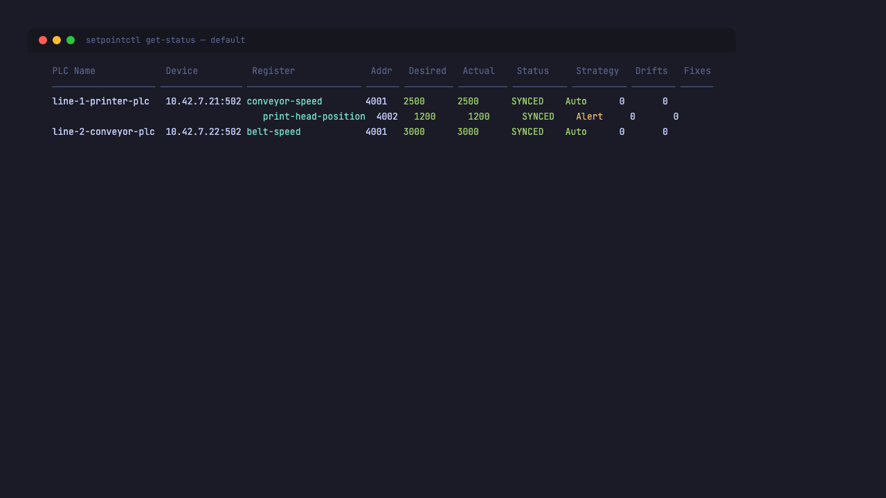
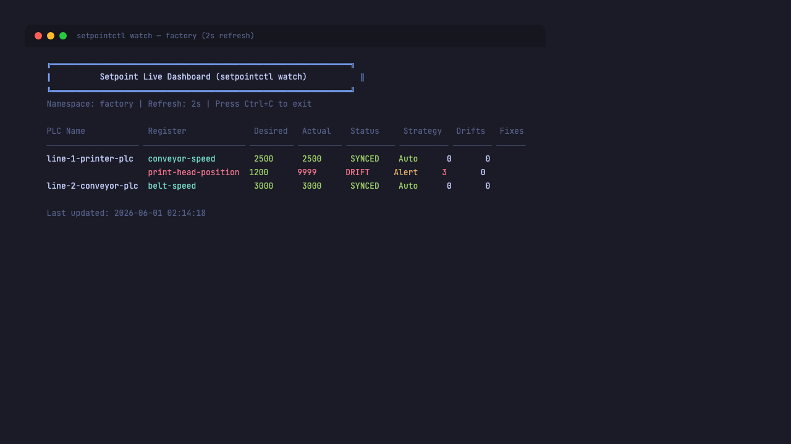
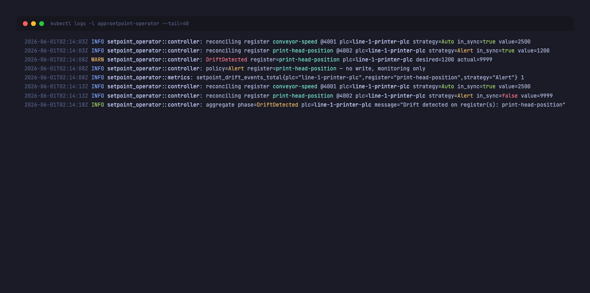
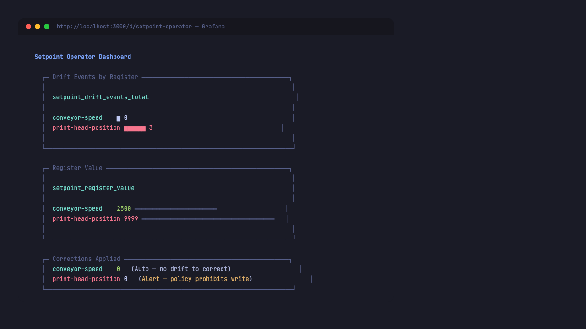
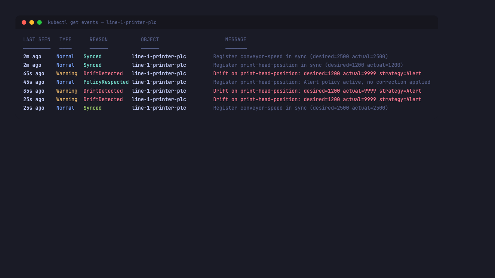

# Setpoint

> **GitOps for the factory floor.**
> A Kubernetes operator that reconciles industrial PLCs as first-class
> resources, with per-register remediation policies and a machine-checkable
> proof of behavior.

[](https://github.com/apinzon/setpoint-operator/actions/workflows/ci.yml)
[](https://github.com/apinzon/setpoint-operator/actions/workflows/e2e-proof.yml)
[](LICENSE)


```yaml
apiVersion: setpoint.io/v1
kind: IndustrialPLC
metadata:
  name: line-1-printer-plc
spec:
  deviceAddress: plc-1.factory.lan
  port: 502
  registers:
    - name: conveyor-speed
      address: 4001
      desiredValue: 2500
      remediation:
        strategy: Auto
        pollIntervalSecs: 5
    - name: print-head-position
      address: 4002
      desiredValue: 1200
      remediation:
        strategy: Alert       # detected, not auto-corrected
        pollIntervalSecs: 5
```

The desired state of every register is git-tracked YAML. The operator
polls the live device, detects drift, and applies the per-register
remediation policy. **Auto** silently writes the desired value back;
**Alert** emits a `Warning DriftDetected` event and bumps a metric
but does not write; **Halt** marks the resource `Failed`.

## Run the flagship proof

The whole project is built around a single CI-checkable claim:

> An operator that auto-corrects an Alert-policy register is broken,
> even if everything else looks fine.

Reproduce it locally:

```sh
make flagship-proof
cat artifacts/latest/proof.json
cat artifacts/latest/report.md
```

This boots a kind cluster, deploys the operator + mock PLC, injects
deterministic drift on the Alert-policy register, and writes a
binary `verdict: PASS | FAIL` plus a human-readable report. The
same flow runs in CI on every PR; see
[`.github/workflows/e2e-proof.yml`](.github/workflows/e2e-proof.yml).

## What it looks like

<table>
<tr>
<td align="center"><b>setpointctl get-status</b></td>
<td align="center"><b>setpointctl watch (drift)</b></td>
</tr>
<tr>
<td></td>
<td></td>
</tr>
<tr>
<td align="center"><b>Operator logs</b></td>
<td align="center"><b>Grafana dashboard</b></td>
</tr>
<tr>
<td></td>
<td></td>
</tr>
</table>

<p align="center"></p>

## Install

### Helm

```sh
helm repo add setpoint https://apinzon.github.io/setpoint-operator
helm install setpoint setpoint/setpoint
```

### Raw manifests

```sh
kubectl apply -f k8s/crd.yaml
kubectl apply -f k8s/rbac.yaml
kubectl apply -f k8s/deployment.yaml
kubectl apply -f config/samples/industrialplc-line1.yaml
```

The sample targets an in-cluster `setpoint-mock-plc` service on
port 5502; deploy `k8s/mock-plc.yaml` first if you don't have real
hardware. Use `k8s/deployment-local.yaml` (imagePullPolicy: Never,
tag `:latest`) for local kind/minikube work.

## How it works

```
┌──────────┐  watch  ┌─────────────┐  poll  ┌──────────────┐
│  git /   │ ──────▶ │  Setpoint   │ ─────▶ │  Modbus PLC  │
│  kubectl │ ◀────── │  operator   │ ◀───── │  (registers) │
└──────────┘  patch  └─────────────┘  write └──────────────┘
                              │
                              ▼
                     ┌──────────────────┐
                     │  setpoint_*      │
                     │  Prometheus      │
                     │  metrics         │
                     └──────────────────┘
                              │
                              ▼
                  ┌────────────────────────┐
                  │  Warning DriftDetected │
                  │  / Normal              │
                  │  DriftCorrected events │
                  └────────────────────────┘
```

The full architecture, including failure modes and reconciliation
loop, lives in [`docs/ARCHITECTURE.md`](docs/ARCHITECTURE.md).

## Repository layout

```
crates/
  operator/         the Kubernetes operator (reconciler + metrics)
  setpointctl/      CLI (get-status, watch, sync)
  mock-plc/         Modbus TCP server with optional chaos mode
  drift-simulator/  overwrites a register on demand for the proof run
k8s/                raw manifests (CRD, RBAC, deployment, sample, mock)
charts/setpoint/    Helm chart
config/samples/     reference IndustrialPLC resources
docs/               architecture, ADRs, executive summary, proof
artifacts/          proof run output (templates ship here; real run overwrites)
scripts/            flagship-proof.sh, capture-metrics.sh, generate-report.sh
```

## Architecture Decision Records

| ADR | Decision |
| --- | -------- |
| [001](docs/adr/001-why-rust-operator.md) | Use Rust + kube-rs for the operator |
| [002](docs/adr/002-modbus-tcp-strategy.md) | Target Modbus TCP first |
| [003](docs/adr/003-rename-to-setpoint.md) | Rename the project from FabGitOps to Setpoint |

## Documentation

- [Executive summary](docs/executive-summary.md) — one-pager, non-technical
- [Proof of concept](docs/proof.md) — technical deep-dive on the proof run
- [Live demo script](docs/demo-script.md) — 5-minute demo walkthrough
- [Architecture](docs/ARCHITECTURE.md) — system design
- [Screenshots capture list](docs/screenshots/README.md) — what to capture, how

## License

MIT. See [LICENSE](LICENSE).
